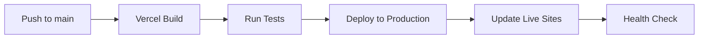

# Deployment Guide

> Complete deployment procedures for the Step Sciences Scheduler platform

## 🎯 Overview

The Step Sciences Scheduler uses **Vercel** for hosting with automatic deployments from GitHub. This guide covers development, staging, and production deployment procedures.

## 🗂️ Table of Contents

- [Quick Deployment](#quick-deployment)
- [Development Deployment](#development-deployment)
- [Production Deployment](#production-deployment)
- [Domain Management](#domain-management)
- [Environment Configuration](#environment-configuration)
- [Rollback Procedures](#rollback-procedures)
- [Monitoring & Health Checks](#monitoring--health-checks)
- [Security Considerations](#security-considerations)
- [Troubleshooting](#troubleshooting)

## ⚡ Quick Deployment

### Standard Deployment (Auto)
```bash
# 1. Commit changes
git add .
git commit -m "feat: add new client configuration"
git push origin main

# 2. Vercel automatically deploys
# ✅ Check: https://vercel.com/dashboard
```

### Manual Deployment
```bash
# Install Vercel CLI
npm install -g vercel

# Deploy to preview
vercel

# Deploy to production
vercel --prod
```

## 🔧 Development Deployment

### Local Development
```bash
# Start development server
pnpm start

# Available at:
# - http://localhost:3000 (default client)
# - http://localhost:3000?company=copernicus-lodge
# - http://192.168.1.x:3000 (mobile testing)
```

### Preview Deployments
Every branch push creates a preview deployment:

```bash
# Create feature branch
git checkout -b feature/new-client-onboarding

# Make changes and push
git add .
git commit -m "feat: add new client onboarding flow"
git push origin feature/new-client-onboarding

# Vercel creates preview URL:
# https://step-sciences-scheduler-website-[hash].vercel.app
```

### Testing Preview Deployments
```bash
# Test specific client on preview
https://[preview-url]?company=gm-oshawa

# Test mobile responsiveness
https://[preview-url]?company=copernicus-lodge
```

## 🚀 Production Deployment

### Deployment Pipeline



### Build Configuration

#### Vercel Settings
```json
{
  "buildCommand": "pnpm build",
  "outputDirectory": "build",
  "installCommand": "pnpm install",
  "framework": "create-react-app"
}
```

#### Build Environment
- **Node.js**: 18.x
- **Package Manager**: pnpm
- **Build Time**: ~2-3 minutes
- **Output**: Static files to `build/`

### Production Checklist

#### Pre-Deployment
- [ ] **Code Review**: All changes reviewed and approved
- [ ] **Local Testing**: Tested across multiple clients
- [ ] **Mobile Testing**: Responsive design verified
- [ ] **Google Calendar**: Integration tested with real calendars
- [ ] **Intake Forms**: All iframe embeds loading correctly
- [ ] **Browser Testing**: Chrome, Firefox, Safari, Edge
- [ ] **Accessibility**: Basic a11y checks passed
- [ ] **Performance**: Lighthouse audit scores acceptable

#### Post-Deployment
- [ ] **Health Check**: All client domains responding
- [ ] **Functional Testing**: End-to-end user flow works
- [ ] **Error Monitoring**: No new errors in logs
- [ ] **Performance**: Site speed within acceptable range
- [ ] **SSL Certificates**: All domains have valid certificates
- [ ] **Client Notification**: Stakeholders informed of changes

## 🌐 Domain Management

### Current Domain Setup

| Domain | Status | SSL | Vercel Config |
|--------|--------|-----|---------------|
| `appointments.stepsciences.com` | ✅ Active | ✅ Auto | Main domain |
| `gmoshawa.stepsciences.com` | ✅ Active | ✅ Auto | Custom domain |
| `gmcami.stepsciences.com` | ✅ Active | ✅ Auto | Custom domain |
| `stellantiswindsor.stepsciences.com` | ✅ Active | ✅ Auto | Custom domain |
| `stellantisbrampton.stepsciences.com` | ✅ Active | ✅ Auto | Custom domain |
| `uniforwindsor.stepsciences.com` | ✅ Active | ✅ Auto | Custom domain |
| `copernicus-lodge.stepsciences.com` | ✅ Active | ✅ Auto | Custom domain |

### Adding New Domains

#### Step 1: Configure in Vercel
```bash
# Via Vercel Dashboard
1. Go to Project Settings → Domains
2. Add domain: newclient.stepsciences.com
3. Copy DNS instructions
```

#### Step 2: Configure DNS (GoDaddy)
```bash
# DNS Configuration
Type: CNAME
Name: newclient
Value: cname.vercel-dns.com
TTL: 1 Hour (3600 seconds)
```

#### Step 3: Wait for Propagation
```bash
# Check DNS propagation
dig newclient.stepsciences.com

# Check SSL certificate (5-30 minutes)
curl -I https://newclient.stepsciences.com
```

#### Step 4: Verify Configuration
```bash
# Test domain resolution
curl -s https://newclient.stepsciences.com | grep -o '<title>.*</title>'

# Expected: <title>Online Appointment Scheduling Portal</title>
```

### SSL Certificate Management
- **Provider**: Let's Encrypt (via Vercel)
- **Renewal**: Automatic
- **Validation**: DNS validation
- **Wildcard**: Not used (individual certificates per subdomain)

## ⚙️ Environment Configuration

### Build-Time Configuration
```javascript
// No environment variables currently used
// All configuration is compile-time static
```

### Client Configuration
```javascript
// src/config/companyConfigs.js
const companyConfigs = {
  'client-id': {
    // Configuration object
  }
};
```

### Future Environment Variables
```bash
# Planned for backend integration
REACT_APP_API_URL=https://api.stepsciences.com
REACT_APP_ENVIRONMENT=production
REACT_APP_SENTRY_DSN=https://...
REACT_APP_ANALYTICS_ID=GA_MEASUREMENT_ID
```

## 🔄 Rollback Procedures

### Quick Rollback (Git)
```bash
# Find last working commit
git log --oneline -10

# Revert to previous commit
git revert HEAD
git push origin main

# Vercel automatically deploys rollback
```

### Vercel Dashboard Rollback
```bash
# Via Vercel Dashboard
1. Go to Deployments tab
2. Find last working deployment
3. Click "..." → "Promote to Production"
4. Confirm promotion
```

### Emergency Rollback
```bash
# Direct commit revert
git reset --hard [commit-hash]
git push --force-with-lease origin main

# ⚠️ Use with caution - rewrites history
```

### Rollback Verification
```bash
# Test critical paths after rollback
1. Default client loading
2. Google Calendar integration
3. Intake form display
4. Mobile responsiveness
5. All custom domains
```

## 📊 Monitoring & Health Checks

### Vercel Analytics
- **Pageviews**: Track across all domains
- **Performance**: Core Web Vitals monitoring
- **Errors**: Runtime error tracking
- **Geography**: User location analytics

### Manual Health Checks
```bash
# Domain availability check
for domain in gmoshawa.stepsciences.com gmcami.stepsciences.com stellantiswindsor.stepsciences.com; do
  echo "Checking $domain..."
  curl -s -o /dev/null -w "%{http_code}" https://$domain
  echo
done
```

### Automated Monitoring (Recommended)
```javascript
// Uptime monitoring with Uptime Robot or similar
const endpoints = [
  'https://appointments.stepsciences.com',
  'https://gmoshawa.stepsciences.com',
  'https://gmcami.stepsciences.com',
  // ... all client domains
];
```

### Performance Monitoring
```bash
# Lighthouse CI (planned)
npm install -g @lhci/cli

# Run performance audit
lhci autorun --config=.lighthouserc.json
```

## 🔒 Security Considerations

### Deployment Security
- **HTTPS Only**: All domains force HTTPS
- **HSTS**: HTTP Strict Transport Security headers
- **No Secrets**: No sensitive data in frontend build
- **Content Security**: CSP headers (planned)

### Access Control
- **GitHub**: Repository access controls
- **Vercel**: Team member permissions
- **DNS**: GoDaddy account security
- **2FA**: Enabled on all accounts

### Security Headers (Planned)
```javascript
// vercel.json security headers
{
  "headers": [
    {
      "source": "/(.*)",
      "headers": [
        {
          "key": "X-Content-Type-Options",
          "value": "nosniff"
        },
        {
          "key": "X-Frame-Options", 
          "value": "DENY"
        },
        {
          "key": "X-XSS-Protection",
          "value": "1; mode=block"
        }
      ]
    }
  ]
}
```

## 🚨 Troubleshooting

### Common Deployment Issues

#### Build Failures
```bash
# Symptom: Build fails in Vercel
# Check: Package.json dependencies
# Fix: Update dependencies, clear cache

pnpm install
pnpm build
```

#### Domain Not Resolving
```bash
# Symptom: Domain shows "This site can't be reached"
# Check: DNS configuration
# Fix: Verify CNAME record

dig newclient.stepsciences.com CNAME
```

#### SSL Certificate Issues
```bash
# Symptom: "Your connection is not private"
# Check: Certificate status in Vercel
# Fix: Regenerate certificate or wait for propagation
```

#### Client Configuration Not Loading
```bash
# Symptom: Wrong branding or default client shown
# Check: Domain detection logic
# Fix: Update companyConfigs.js domain mapping
```

### Debug Commands
```bash
# Check build locally
pnpm build
pnpm preview

# Test specific client locally
http://localhost:3000?company=client-id

# Verify configuration loading
console.log(getCompanyConfig('client-id'));
```

### Emergency Contacts
- **Vercel Support**: Via dashboard support chat
- **DNS Issues**: GoDaddy support
- **GitHub Issues**: Repository issue tracker
- **Client Issues**: Direct client communication channels

## 📈 Performance Optimization

### Build Optimization
```json
// package.json optimization scripts
{
  "scripts": {
    "build:analyze": "npm run build && npx webpack-bundle-analyzer build/static/js/*.js",
    "build:prod": "npm run build && npm run check",
    "predeploy": "npm run lint && npm run build"
  }
}
```

### Caching Strategy
- **Static Assets**: 1 year cache (with versioning)
- **HTML**: No cache (for dynamic client detection)
- **Fonts**: Browser cache only
- **Images**: 1 month cache

### CDN Configuration
- **Provider**: Vercel Edge Network
- **Regions**: Global coverage
- **Cache**: Automatic optimization
- **Compression**: Brotli + Gzip

## 📋 Deployment Schedule

### Regular Deployments
- **Frequency**: As needed (feature-driven)
- **Window**: Business hours (EST)
- **Duration**: 2-5 minutes
- **Downtime**: None (atomic deployments)

### Maintenance Windows
- **Frequency**: Monthly (first Sunday)
- **Duration**: 30 minutes
- **Purpose**: Dependency updates, security patches
- **Notification**: 48 hours advance notice

### Emergency Deployments
- **Trigger**: Security issues or critical bugs
- **Approval**: Minimal process
- **Testing**: Reduced but sufficient
- **Communication**: Immediate notification

---

## 📞 Support

For deployment issues:
1. Check Vercel deployment logs
2. Verify DNS configuration
3. Test locally first
4. Check [Troubleshooting Guide](TROUBLESHOOTING.md)
5. Contact development team

**Remember**: All deployments are zero-downtime thanks to Vercel's atomic deployment system.

*Last updated: January 2025*